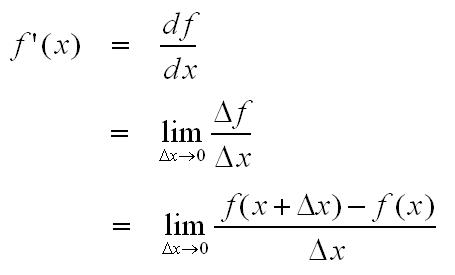

# 밑바닥부터 시작하는 딥러닝1 - 04 - 신경망 학습

## 손실 함수

손실 함수 : 신경망이 훈련 데이터를 잘 처리하지 못하느냐를 판별하는 함수

#### 평균 제곱 오차

```python
0.5 * np.sum((y-t)**2)
```

((출력값 - 정답 레이블) ** 2) / 2 


#### 교차 엔트로피 오차

log x의 경우 x가 1일 때 y값이 0이고 x값이 0에 가까워질수록 음의 무한에 가까워지는 것을 이용한다.

```python
-np.sum(t * np.log(y + 1e-7))
```

공식에서는 실제로 -inf의 경우 계산이 불가능해지기 때문에 아주 작은 수를 더해 이를 방지한다.


#### 미니배치 학습

아주 많은 데이터를 학습할 경우,  이를 확인할 손실함수를 연산하는 데에도 많은 시간이 소요된다. 그래서 훈련 데이터 중 일부만을 이용해 학습하는데 이를 미니배치 학습이라고 한다.


#### 손실함수를 활용하는 이유

정확도를 지표로 삼을 경우, '가중치 매개변수 값의 미분값'이 0이 되어버려서 실제로 유의미한 반영이 되지 않기 때문. (활성화 함수와 같은 이치)


## 수치 미분

간단한 미분 공부



```python
# 파이선에서 잘못된 미분식
h = 10e-50
(f(x+h) - f(x)) / h
```


f(x)의 x에 대한 미분(x에 대한 f(x)의 변화량)은 0에 가까운 분모값을 사용해서 계산하는데, 파이썬에서 지나치게 낮은 수를 사용할 경우 반올림 오차(대충 소수점 8자리 이하의 값이 생략되는)가 발생하기 때문에 `10**-4`를 h값으로 활용한다.

또한 h를 무한히 0으로 좁히는게 불가능하기 때문에 차분(임의 두 점에서의 함수 값의 차이)에 문제가 발생한다. (= 진정한 접선과 근사로 구한 접선간의 차이가 있다) 이를 극복하기 위해 x를 중심으로 전후의 차분을 계산하는 중심 차분(중앙 차분)을 사용한다.


```python
# 위 두가지 문제점을 해결하기 위해 개선된 미분식
h = 1e-4;
(f(x+h) - f(x-h)) / (2*h)
```


이를 통해 완전히 정확한 미분값은 아니지만 유의미한 근사치를 얻어낼 수 있다.

변수 여러개를 가진 함수에 대한 미분을 `편미분`이라고 한다. 이를 구하는 방법은 변수가 하나인 함수를 정의하고 그 함수를 미분하는 형태로 구현하는 것이다.


## 기울기

`편미분`이 각각의 변수를 기준으로 변수가 여러개인 함수의 미세한 이동량을 구한 것이라면 모든 변수의 편미분을 벡터로 정리한 것이 `기울기(gradient)`라고 한다. 기울기는 각 지점에서 낮아지는 방향을 가르키기 때문에 `기울기가 가르키는 방향은 각 장소에서 함수의 출력 값을 최대로 줄이는 방향이다.`

위의 특성을 활용한 것이 `경사하강법(gradient descent method)`으로 이를 통해 손실함수가 낮은 값을 향해 나아가도록 학습시킬 수 있다. 

갱신될 변수 = 기존 변수 - (학습률 * 변수에 대한 함수의 편미분 값)

위 공식에서 학습률은 `하이퍼파라미터`(사람이 직접 지정해야 하는 변수)로 `적당한 값`을 입력해야 한다. 무슨 김장 담그는 어머니나 하실 말씀 같지만 너무 큰 학습률은 큰 값으로 발산하게 만들고 너무 작은 학습률은 갱신이 제대로 되지 않는 문제가 발생한다.


## 학습 알고리즘 구현하기

지난 챕터3에서 했던 것에서 각 매개변수의 기울기를 구하고 이를 조금씩 기존 매개변수에 갱신시키는 과정을 추가한다.
