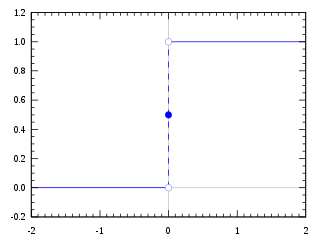
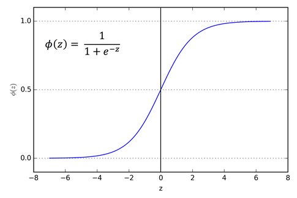

# 밑바닥부터 시작하는 딥러닝1 - 03 - 신경망

## 퍼셉트론에서 신경망으로

신경망은 퍼셉트론과 유사하지만 다른 특징을 가지고 있다. 입력층과 출력층 사이에 은닉층이라는 보이지 않는 층이 존재한다. 또한 기존의 입력 값, 가중치, 편향 뿐만 아니라 활성화 함수(h(x))가 등장한다. 활성화 함수란 입력 신호의 총합이 활성화를 일으키는지를 정하는 역할을 하는 함수이다.

a = w1x1 + w2x2

y = h(a)


## 활성화 함수

활성화 함수는 임계값을 경계로 출력이 바뀌는데 이런 함수들을 계단 함수라고 한다.

#### 단위 계단 함수



#### 시그모이드 함수



위의 단위 계단 함수와 다르게 시그모이드 함수는 매끄러운 곡선이며 입력값에 따라 연속적으로 변화함. 하지만 입력값이 0 또는 1이라는 하나의 결과로 수렴한다는 점에서 기존의 계단 함수의 역할을 충분히 수행한다.

#### ReLU 함수


최근에 시그모이드 함수를 대체할 활성화 함수로 사용되는 ReLU 함수이다.


위 함수들의 공통점으로 비선형 함수라는 점이 있다. 선형 함수를 활성화 함수로 사용할 경우, 은닉층이 없는 네트워크로도 표현이 가능하기 때문에 여러 층의 은닉층으로 쌓는 의미가 사라진다.  그렇기 때문에 `활성화 함수로는 비선형 함수를 사용한다`.


## 다차원 배열의 계산

```python
import numpy as np
A = np.array([[1,2,3], [4,5,6]])
A.shape # (2,3)
B = np.array([[1,2], [3,4], [5,6]])
B.shape # (3,2)
np.dot(A, B)
'''
array([[22, 28],
       [49, 64]])
'''
```

행결의 곱을 할 때에는 대응하는 차원의 원소 수를 일치시켜야 한다. 예제의 경우,

(2,3) * (3,2) = (2,2) 로 첫번째 배열의 열과 두번째 배열의 행이 같다.


## 3층 신경망 구현하기

입력층(2개) -> 첫번째 은닉층(3개) -> 두번쨰 은닉층(2개) -> 출력층(2개)

은닉층에서의 계산은 위에서 설명한 대로,

a = w1x1 + w2x2

y = h(a)

의 형태로 반복된다.

그리고 `출력층에서 용도에 맞게 기존의 활성화 함수가 아닌 항등함수 또는 소프트맥스 함수를 사용한다.`

(분류의 경우에는 소프트맥스 함수, 회귀의 경우에는 항등 함수를 사용)


#### 항등 함수

입력값을 그대로 출력 (`회귀가 연속된 값들 중 올바른 값을 예측하는 것이기 때문`)


#### 소프트맥스 함수

입력 신호의 지수 함수를 모든 입력 신호의 지수 함수의 합으로 나눈 값

yk = exp(ak) / exp(ai)들의 합(i: 1~n)

위와 같은 함수를 활용하게 되면 총합이 1인 0부터 1사이의 값들의 배열이 출력된다. 이를 통해

`입력값이 정해진 label들 중에 어떤 label에 해당하는지에 대한 확률` 을 알 수 있다.

softmax 함수를 온전히 활용하기에는 지수 함수의 특성으로 overflow를 뱉어낼 위험이 존재한다. 이를 해결하기 위해 추가적인 처리가 필요한데 일반적으로는 소프트맥스 함수내에 입력 신호 중의 최대값을 빼는 과정을 추가한다.


## 손글씨 숫자 인식

머신러닝 계의 helloworld인 `MNIST Dataset`의 활용을 통해 실제 데이터 분석 과정에 입문이 가능하다. MNIST는 훈련 데이터와 시험 데이터로 나눠 사용하며 이는 훈련을 통해 얻은 가중치들이 실제로 얼마나 적중하는지를 가늠하는데에 필요하다. 


해당 예제에서는 load_mnist 함수를 통해 normalize(각 픽셀을 0과 1사이의 값으로 변환), flatten(이미지 픽셀값을 1차원 numpy.array로 변환), one_hot_label(라벨값을 정답을 뜻하는 원소만 1로 지정하고 나머지를 0으로 지정)와 같은 옵션을 제공한다.


```
입력층 (100 x 784) : (100개 단위의 이미지 파일 * 28x28 pixel image)
W1 (784 x 50)
W2 (50 x 100)
W3 (100 x 10)
출력층 10개 : (0부터 9사이의 정수)
```


위 모델에서 100개 단위의 이미지 파일로 구성한 이유는 수많은 데이터를 한꺼번에 처리할 수 없기 때문이다. 위와 같이 묶인 입력 데이터를 배치(batch)라고 한다.


3층 신경망 구현하기에서 설명한 로직을 그대로 MNIST에 대입하여 구현하면 된다.