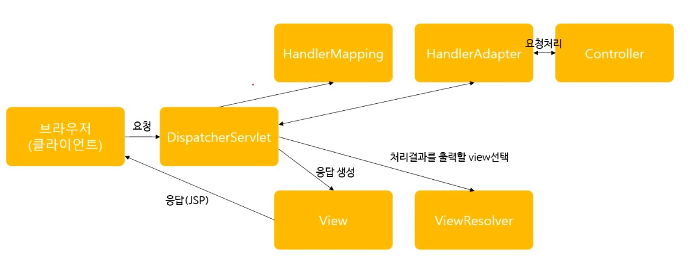

# 자바 스프링 프레임워크 - 03

### 생명주기

스프링 컨테이너 생명주기 :

1. GenericXmlApplicationContext를 이용한 스프링 컨테이너 초기화(생성)
2. getBean()을 이용한 빈(Bean)객체 이용
3. close()를 이용한 스프링 컨테이너 종료

빈(Bean) 객체 생명주기 : 스프링 컨테이너의 생명주기와 같음

구현방법 :

1. InitializingBean, DisposableBean 인터페이스 사용

2. init-method, destroy-method 속성

- 1.xml 파일의 bean에 init-method, destroy-method 정의
- 2.bean에 해당하는 class 내부에 init-method, destrory-method에 정의한 이름을 사용한 메서드 생성


### 어노테이션을 이용한 스프링 설정

xml파일을 Java파일로 변경하기

```java
// 스프링 컨테이너로 사용
@Configuration
public class MemberConfig {
    // Bean 설정
    /* <bean id="studentDao" class="ems.member.dao.StudentDao" /> */
    @Bean
    public StudentDao studentDao() {
        return new StudentDao();
    }
    /* <bean id="registerService" class="ems.member.service.StudentRegisterService">
    <constructor-arg ref="studentDao"></constructor-arg>
    </bean> */
    @Bean
    public StudentRegisterService registerService() {
        return new StudentRegisterService(studentDao());
    }
    /* <bean id="dataBaseConnectionInfoDev" class="ems.member.DataBaseConnectionInfo">
    <property name="jdbcUrl" value="jdbc:oracle:thin:@192.168.0.1:1521:xe" />
    <property name="userId" value="c##scott" />
    <property name="userPw" value="tiger" />
    </bean> */
    @Bean
    public DataBaseConnectionInfo dataBaseConnectionInfoDev() {
        DataBaseConnectionInfo infoDev = new DataBaseConnectionInfo();
        infoDev.setjdbcUrl("jdbc:oracle:thin:@192.168.0.1:1521:xe");
        infoDev.setuserId("c##scott");
        infoDev.setuserPw("tiger");
        
        return infoDev;
    }
    /* <bean id="informationService" class="ems.member.service.EMSInfomationService">
    <property name="Info">
    	<value>info's value</value>
    </property>
    <property name="CopyRight">
    	<value>copyright's value</value>
    </property>
    <property name="developers">
    	<list>
    		<value>Nuguri</value>
    		<value>Showmaker</value>
    		<value>Nuclear</value>
    	</list>
    </property>
    <property name="administrators">
    	<map>
    		<entry>
    			<key>
    				<value>Cheney</value>
    			</key>
    			<value>cheney@springPjt.org</value>
    		</entry>
    	</map>
    </property>
    <property name="dbInfos">
    	<map>
    		<entry>
    			<key>
    				<value>dev</value>
    			</key>
    			<ref bean="dataBaseConnectionInfoDev" />
    		</entry>
    	</map>
    </property>
    </bean>
    */
    @Bean
    public EMSInfomationService informationService() {
        EMSInfomationService info = new EMSInfomationService();
        
        info.setInfo("info's value");
        info.setCopyRight("copyright's value");
        
        ArrayList<String> developers = new ArrayList<String>();
        developers.add("Nuguri");
        developers.add("Showmaker");
        developers.add("Nuclear");
        info.setDevelopers(developers);
        
        Map<String, dataBaseConnectionInfo> dbInfos = new HashMap<String, dataBaseConnectionInfo>();
        // 사전에 정의된 객체 불러오기
        dbInfos.put("dev", dataBaseConnectionInfoDev());
        info.setDbInfos(dbInfos);               
        
        return info;
    }    
}

/* GenericXmlApplicationContext ctx = new GenericXmlApplicationContext("classpath:applicationContext.xml") */
AnnotationConfigApplicationContext ctx = new AnnotationConfigApplicationContext(MemberConfig.class);
```

java 파일 분리 : 분리되어 있더라도 자동주입이 가능

1. Bean 객체 정의
2. return 되는 값을 받기 위해 필요로 하는 부분에서 빈 객체 정의
3. @Autowired로 의존성 주입
4. 통합절차를 수행하는 java 파일에서 복수의 프로퍼티를 그냥 삽입

@import 어노테이션

```java
// 통합을 위한 java 파일에서 1,2,3번 java파일 불러오기
// 통합 파일
AnnotationConfigApplicationContext ctx = new AnnotationConfigApplicationContext(MemberConfig1.class,MemberConfig2.class,MemberConfig3.class);

// 1번 파일에서 2,3번 파일을 불러오고 통합을 위한 java 파일에선 1번만 실행
// 1번 파일
@Configuration
@Import({MemberConfig2.class,MemberConfig3.class})
```


### 웹 프로그래밍 설계 모델

웹 프로그래밍을 구축하기 위한 설계 모델 :

브라우저 - WAS(웹 어플리케이션 서버) - DB

- Model1 - WAS 구조를 JSP <-> Service&DAO 통신할 수 있도록 통째로 개발
  - 장점 : 개발 속도 빠름
  - 단점 : 유지보수 어려움, 스파게티 코딩의 가능성 높음
- Model2 - WAS 구조가 Controller - Service - DAO - Model의 형태로 연결되고 얻은 결과를 Controller가 View 객체(JSP)를 만들어서 reponse
  - 장점 : 각 기능을 모듈로 나눠놓기 떄문에 유지보수가 수월해짐
  - 단점 : 처음 만들 때 시간이 더 소요됨 


스프링 MVC프레임워크 설계 구조 :



1. 클라이언트가 요청
2. DispatcherServlet이 받고 HandlerMapping으로 전달
3. HandlerMapping이 알맞은 Controller를 선택하고 DispatcherServlet에 전달
4. DispatcherServlet이 HandlerAdapter로 전달
5. HandlerAdapter가 해당 Controller 내 요청을 처리하기 알맞은 메소드를 찾아서 작업한 결과를 DispatcherServlet에 전달
6. DispatcherServlet이 ViewResolver에 전달하고 가장 적합한 JSP파일을 찾도록 함
7. 찾은 결과를 DispatcherServlet이 받고 View 작성
8. 클라이어트에 응답


DispatcherServlet 설정 : web.xml에 서블릿 등록

```xml
<servlet>
    <servlet-name>appServlet</servlet-name>
    <servlet-class>org.spring.framework.web.servlet.DispatcherServlet</servlet-class>
    <init-param>
        <param-name>contextConfigLocation</param-name>
        <param-value>/WEB-INF/spring/appServlet/servlet-context.xml</param-value>
    </init-param>
    <load-on-startup>1</load-on-startup>
</servlet>

<servlet-mapping>
    <servlet-name>appServlet</servlet-name>
    <url-pattern>/</url-pattern>
</servlet-mapping>
```


Controller 객체 

- @Controller

1. servlet-context.xml에 `<annotation-driven />` 작성해 초기값 정의
2. Controller로 사용하고자 하는 class에 @Controller 어노테이션 사용


- @RequestMapping : Controller 내 method에 @RequestMapping("/routename") 설정


- Model 타입의 파라미터

```java
@RequestMapping("/success")
public String success(Model model) {
    model.setAtrribute("tempData", "model has data!");
}
```


View 객체

```xml
<beans:bean class="org.springframework.web.servlet.view.InternalResourceViewResolver">
    <beans:property name="prefix" value="/WEB-INF/views" />
    <beans:property name="suffix" value=".jsp" />
</beans:bean>
```


전체적인 웹프로그래밍 구조

1. 클라이언트 요청
2. Controller
3. 사용자 요청에 해당하는 메서드 실행
4. View 검색
5. View로 응답


### 스프링 MVC 웹서비스

웹 서버(Tomcat) 다운로드 및 이클립스 연동 : JSP 강좌와 중복

STS(Spring Tool Suit) 설치 : help - eclipse marketplace - sts 검색 및 설치

STS를 이용한 웹 프로젝트 생성 :

1. New -> Other 선택
2. Spring Legacy Project -> Spring MVC Project (STS 3 version)

프로젝트 전체 구조 :

1. java파일 : 어플리케이션에서 사용하는 Controller, Service, DAO 객체 등
2. webapp : 웹과 관련된 파일들(스프링 설정파일, JSP, HTML 등)
3. resources : JSP 파일을 제외한 html, css, js
4. spring 폴더 : 스프링 컨테이너 생성을 위한 스프링 설정파일
5. views 폴더 : View로 사용될 JSP 파일
6. pom.xml : 메인 레파지토리에서 프로젝트에 필요한 라이브러리를 내려받기 위한 메이븐 설정 파일

web.xml : DispatcherServlet을 등록하고 서블릿 맵핑을 '/'

DispatchServlet : request, handlerMapping, handlerAdapter, viewResolver를 연결해주는 객체 

servlet-context.xml : 스프링 설정의 역할을 하는 파일

Controller : 사용자의 요청을 실제로 처리하는 객체들 (Service - DAO 순으로 연결됨)

View : 클라이언트 요청 정보(url맵핑값)에 해당하는 jsp파일 실행


### STS를 이용하지 않은 웹 프로젝트

스프링 프로젝트 구조 이해를 위한 강좌임으로 필요로 하는 파일구조로 대체

```
project root folder
|- src
	|-- main
		|--- java
			|---- basePackage folder
				|----- controllers*.java
		|--- webapp
			|---- WEB-INF
				|----- spring
					|------ appServlet
						|------- servlet-context.xml
					|------ root-context.xml
				|----- views
					|------ views*.jsp
				|----- web.xml	
|- pom.xml
```


### Service & Dao 객체 구현

한글 처리 : web.xml에 추가

```xml
<filter>
		<filter-name>CharacterEncodingFilter</filter-name>
		<filter-class>org.springframework.web.filter.CharacterEncodingFilter</filter-class>
		<init-param>
			<param-name>encoding</param-name>
			<param-value>UTF-8</param-value>
		</init-param>
		<init-param>
			<param-name>forceEncoding</param-name>
			<param-value>true</param-value>
		</init-param>
	</filter>
	<filter-mapping>
		<filter-name>CharacterEncodingFilter</filter-name>
		<url-pattern>/*</url-pattern>
	</filter-mapping>
```


서비스 객체, DAO 객체 구현 : 

1. new 연산자를 이용한 service 객체 생성 및 참조
```java
MemberService service = new MemberService();
```
2. 스프링 설정파일을 이용한 service 객체 생성 및 의존 객체 자동 주입
```xml
<beans:bean id="service" class="com.bs.lec17.member.service.MemberService"></beans:bean>
```
```java
@Autowired
MemberService service;
```
3. 어노테이션을 이용해 service 객체 생성 및 의존 객체 자동 주입
```java
/// Service Class
@Service
// @Component
// @Repository
public class MemberService implements IMemberService {
    // ...
}

/// DAO Class
//@Component
@Repository
public class MemberDao implements IMemberDao {
    // ...
}

/// Controller Class
@Controller
public class MemberController {
    @Autowired
    MemberService service;

    @Autowired
    MemberDao dao;
}
```


### Controller 객체 구현

@RequestMapping을 이용한 URL맵핑 : 

```java
// GET 방식의 경우 @RequestMapping("/memJoin") 으로 작성해도 무방
@RequestMapping(value="/memJoin", method=RequestMethod.POST)
public String memJoin(Model model, HttpServletRequest request){
    
}
```


요청 파라미터

1. HttpServlet Request 객체를 이용한 HTTP 전송 정보 얻기
```java
public String memLogin(Model model, HttpServletRequest request) {
    	String memId = request.getParameter("memId");
		String memPw = request.getParameter("memPw");
     // ...
}
```
2. @RequestParam 어노테이션을 이용한 HTTP 전송 정보 얻기
```java
public String memLogin(Model model, @RequestParam("memId") String memId, @RequestParam(value="memPw", required=false, defaultValue="1234") String memPw) {
 // ...   
}

```
3. 커맨드 객체를 이용한 HTTP 전송 정보 얻기(jsp에서 parameter, object로 사용하는 차이점 유의)
```java
/// before
@RequestMapping(value="/memJoin", method=RequestMethod.POST)
public String memJoin(Model model, HttpServletRequest request) {
		String memId = request.getParameter("memId");
		String memPw = request.getParameter("memPw");
		String memMail = request.getParameter("memMail");
		String memPhone1 = request.getParameter("memPhone1");
		String memPhone2 = request.getParameter("memPhone2");
		String memPhone3 = request.getParameter("memPhone3");
		
		service.memberRegister(memId, memPw, memMail, memPhone1, memPhone2, memPhone3);		
		
		model.addAttribute("memId", memId);
		model.addAttribute("memPw", memPw);
		model.addAttribute("memMail", memMail);
		model.addAttribute("memPhone", memPhone1 + " - " + memPhone2 + " - " + memPhone3);
		
	return "memJoinOk";
}


/// after
@RequestMapping(value="/memJoin", method=RequestMethod.POST)
public String memJoin(Member member) {
		service.memberRegister(member.getMemId(),member.getMemPw(),member.getMemMail(), member.getMemPhone1(), member.getMemPhone2(), member.getMemPhone3())		

		
	return "memJoinOk";
}
```


@ModelAttribute : 

1. 커맨드 객체의 이름을 변경할 수 있고, 변경된 이름은 뷰에서 커맨드 객체를 사용할 참조할 때 사용됨

| 컨트롤러                                                     | 뷰              |
| ------------------------------------------------------------ | --------------- |
| public String memJoin(Member member)                         | ${member.memId} |
| public String memRemove(@ModelAttribute("mem") Member member) | ${mem.memId}    |

2. @ModelAttribute가 적용된 메서드는 호출하지 않아도 같이 호출됨


커맨드 객체 프로퍼티 데이터 타입 : 

1. 기본 데이터 타입의 경우: 일반적인 형태 (ex) `private String memName;`) 
2. 중첩 커맨드 객체를 이용한 List 구조의 경우: 중첩된 객체를 사용해야할 때  (ex) `private List<MemPhone> memPhones;`) 


Model & ModelAndView : 컨트롤러에서 뷰에 데이터를 전달하기 위해 사용되는 객체

1. Model : 뷰에 데이터만을 전달하기 위한 객체
```java
model.addAttribute("memBef", members[0]);
model.addAttribute("memAft", members[1]);

return "memModifyOk";
```
2. ModelAndView 데이터와 뷰의 이름을 함께 전달하는 객체
```java
ModelAndView mav = new ModelAndView();
mav.addObject("memBef", members[0]);
mav.addObject("memAft", members[1]);
mav.setViewName("memModifyOk");

return mav;
```
